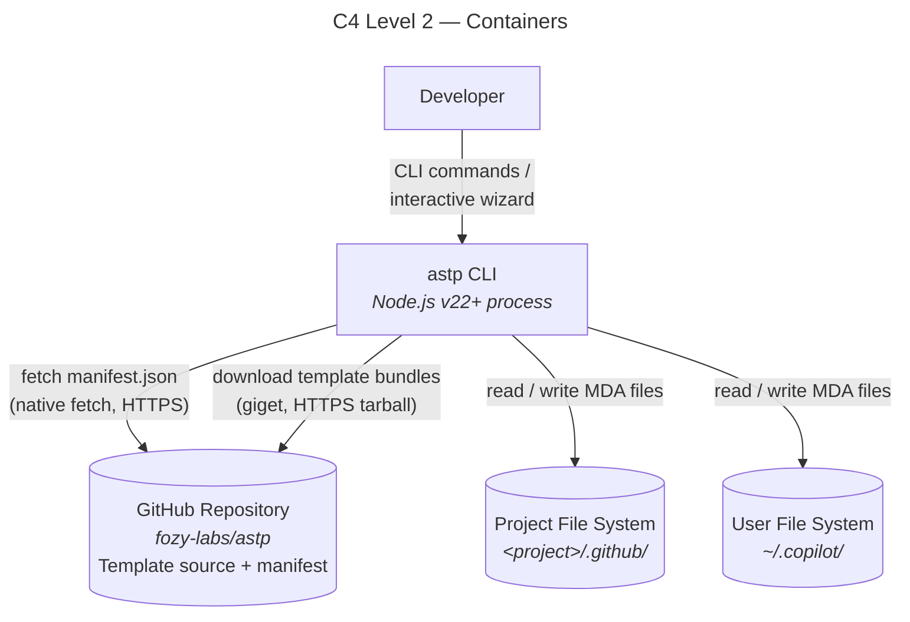
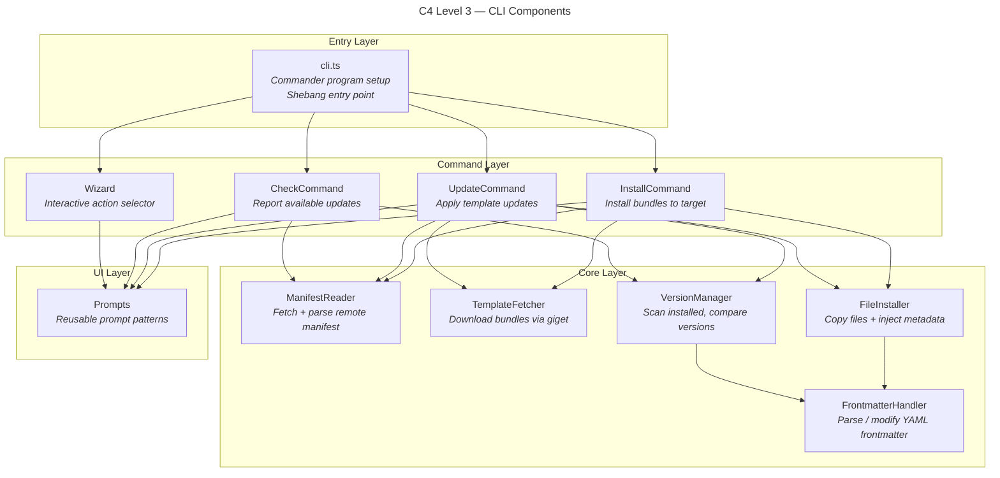
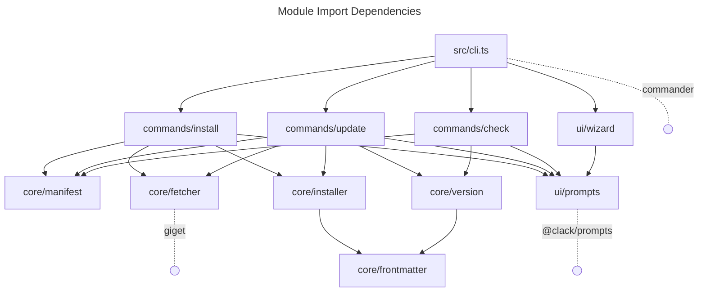

# System Architecture: astp CLI

## 1. Overview

`astp` is a Node.js CLI tool that manages MDA files — markdown configuration files consumed by AI coding agents (VS Code GitHub Copilot). The CLI installs, updates, and checks for updates to template bundles sourced from the `fozy-labs/astp` GitHub repository.

Architecture decisions (detailed in [04-decisions.md](./04-decisions.md)):

| Concern | Decision | ADR |
|---------|----------|-----|
| Template distribution | giget + native `fetch()` | ADR-1 |
| Versioning | Semver per bundle in manifest, frontmatter for local tracking | ADR-2 |
| CLI framework | Commander.js | ADR-3 |
| Interactive prompts | @clack/prompts | ADR-4 |
| Template contract | Manifest-driven | ADR-5 |
| Local metadata | `astp-*` fields in file frontmatter | ADR-6 |


## Constraints

| Constraint | Reference | Notes |
|-----------|-----------|-------|
| Node.js >= 22 | Q12 | Required for native `fetch()`, stable ESM support, and modern `node:` module APIs |
| ESM with `"type": "module"` | Q13 | All source files use `import`/`export` syntax; no CommonJS |
| TypeScript | — | Entire codebase authored in TypeScript, compiled to ESM |
| Minimal dependencies | ADR-1, ADR-3, ADR-4 | Only three runtime deps: `commander`, `@clack/prompts`, `giget` |


## 2. C4 Level 2: Container Diagram

The system involves four containers: the CLI process, the remote template source, and two possible install targets.



**Container responsibilities:**

- **astp CLI** — the single executable process. Parses commands, prompts the user, fetches templates, manages file installation and version tracking.
- **GitHub Repository** — `fozy-labs/astp` repo on GitHub. Stores the canonical template files in `src/templates/` and the manifest at `src/templates/manifest.json`. Accessed via HTTPS only (no git clone). [ref: ../01-research/02-external-research.md §3]
- **Project File System** — the `.github/` directory within the user's project. Target for project-level installs. Version-controlled with the project. [ref: ../01-research/01-codebase-analysis.md §1]
- **User File System** — the `~/.copilot/` directory in the user's home folder. Target for user-level installs. Not version-controlled. [ref: ../01-research/01-codebase-analysis.md, TASK.md]


## 3. C4 Level 3: Component Diagram

Internal structure of the astp CLI process, organized into four layers.




## 4. Module Responsibility Zones

| Module | File | Responsibility | External Dep |
|--------|------|---------------|-------------|
| Entry | `src/cli.ts` | `#!/usr/bin/env node` shebang. Creates Commander `program`. Registers commands. Default action → wizard. Calls `program.parseAsync()`. | `commander` |
| InstallCommand | `src/commands/install.ts` | Orchestrates install flow: fetch manifest → prompt for target → download bundle → install files. | — |
| UpdateCommand | `src/commands/update.ts` | Orchestrates update flow: scan installed → fetch manifest → compare → download updates → warn about modified files → apply. | — |
| CheckCommand | `src/commands/check.ts` | Orchestrates check flow: scan installed → fetch manifest → compare → display report. | — |
| Wizard | `src/ui/wizard.ts` | Interactive wizard: `intro()` → select action → delegate to command handler → `outro()`. | — |
| Prompts | `src/ui/prompts.ts` | Reusable @clack/prompts wrappers: `selectTarget()`, `selectBundles()`, `confirmAction()`, `showReport()`. | `@clack/prompts` |
| ManifestReader | `src/core/manifest.ts` | Fetches `manifest.json` from GitHub via native `fetch()`. Parses and validates against expected schema. | Node.js `fetch` |
| TemplateFetcher | `src/core/fetcher.ts` | Wraps giget's `downloadTemplate()`. Downloads a bundle subdirectory to a temp directory. Handles auth and cache options. | `giget` |
| FileInstaller | `src/core/installer.ts` | Reads template files from temp dir. Injects `astp-*` frontmatter via FrontmatterHandler. Creates target directories. Writes files to install target. | — |
| VersionManager | `src/core/version.ts` | Recursively scans `.md` files in install target. Extracts `astp-*` metadata via FrontmatterHandler. Groups by bundle. Compares installed versions against manifest. Generates `UpdateReport`. Detects file modifications via hash comparison. | — |
| FrontmatterHandler | `src/core/frontmatter.ts` | Parses YAML frontmatter from markdown content. Extracts `astp-*` fields. Injects/updates `astp-*` fields. Adds frontmatter block to files that lack one (stage definitions). Strips `astp-*` fields for hash computation. | — |
| Types | `src/types/index.ts` | Shared TypeScript interfaces: `Manifest`, `Bundle`, `TemplateItem`, `InstalledFileMetadata`, `InstallTarget`, `UpdateReport`, etc. | — |


## 5. Module Dependency Diagram

Directed graph showing import relationships between modules. Dashed lines indicate external package dependencies.



**Key observations:**
- `core/frontmatter` is the lowest-level module — no internal dependencies. Used by both `installer` and `version`.
- `core/manifest` has no internal dependencies — it only uses the native `fetch()` API.
- All command modules depend on `ui/prompts` for interactive input when flags are omitted [ref: ../01-research/03-open-questions.md Q10, user decision: Option 3].
- External dependencies are isolated: `commander` is only in `cli.ts`, `@clack/prompts` only in `ui/prompts`, `giget` only in `core/fetcher`.


## 6. Template Source Organization

Templates live in `src/templates/` as the canonical source [ref: ../01-research/03-open-questions.md Q2, user decision: Option 1]. The `.github/` files in this repository become an install target populated by running `astp install` on the project itself.

```
src/templates/
├── manifest.json                              ← central manifest (ADR-5)
├── base/                                      ← bundle: base (default, 1 file)
│   └── skills/
│       └── orchestrate/
│           └── SKILL.md
└── rdpi/                                      ← bundle: rdpi (optional, 21 files)
    ├── agents/
    │   ├── RDPI-Orchestrator.agent.md
    │   ├── rdpi-approve.agent.md
    │   ├── rdpi-architect.agent.md
    │   ├── rdpi-codder.agent.md
    │   ├── rdpi-codebase-researcher.agent.md
    │   ├── rdpi-design-reviewer.agent.md
    │   ├── rdpi-external-researcher.agent.md
    │   ├── rdpi-implement-reviewer.agent.md
    │   ├── rdpi-plan-reviewer.agent.md
    │   ├── rdpi-planner.agent.md
    │   ├── rdpi-qa-designer.agent.md
    │   ├── rdpi-questioner.agent.md
    │   ├── rdpi-redraft.agent.md
    │   ├── rdpi-research-reviewer.agent.md
    │   ├── rdpi-stage-creator.agent.md
    │   └── rdpi-tester.agent.md
    ├── instructions/
    │   └── thoughts-workflow.instructions.md
    └── rdpi-stages/
        ├── 01-research.md
        ├── 02-design.md
        ├── 03-plan.md
        └── 04-implement.md
```

**Convention:** Each bundle directory's internal structure mirrors the install target structure. `rdpi/agents/foo.agent.md` installs to `<root>/agents/foo.agent.md`. The manifest lists explicit source→target mappings for each item (see [03-model.md](./03-model.md) §4 for manifest schema).

File counts by bundle [ref: ../01-research/01-codebase-analysis.md §5]:

| Bundle | Files | Categories | Default |
|--------|-------|-----------|--------|
| `base` | 1 | 1 skill | Yes |
| `rdpi` | 21 | 16 agents, 1 instructions, 4 stage definitions | No |


## 7. Install Target Mapping

The user selects the install target every time [ref: ../01-research/03-open-questions.md Q6, user decision: Option 3]. The install root changes based on selection:

| Target | Install Root | Persisted |
|--------|-------------|-----------|
| `project` | `<cwd>/.github/` | Yes (version-controlled) |
| `user` | `~/.copilot/` | No (local to machine) |

The `target` field in each manifest item specifies a path relative to the install root. The FileInstaller computes the full path as:

```
fullPath = path.join(installRoot, item.target)
```

### Project-level install structure

```
<project>/.github/
├── agents/                         ← rdpi bundle
│   ├── RDPI-Orchestrator.agent.md
│   └── rdpi-*.agent.md (×15)
├── skills/                         ← base bundle
│   └── orchestrate/
│       └── SKILL.md
├── instructions/                   ← rdpi bundle
│   └── thoughts-workflow.instructions.md
└── rdpi-stages/                    ← rdpi bundle
    ├── 01-research.md
    ├── 02-design.md
    ├── 03-plan.md
    └── 04-implement.md
```

### User-level install structure

```
~/.copilot/
├── agents/
├── skills/
│   └── orchestrate/
│       └── SKILL.md
├── instructions/
└── rdpi-stages/
```

Same subdirectory structure under a different root. The manifest's `target` paths are identical for both targets.


## 8. Extension Points

The architecture is designed for v0.1.0 (install + update + check) but supports future growth:

| Extension | How it's supported | Required changes |
|-----------|-------------------|-----------------|
| **New bundles** | Add directory under `src/templates/`, add entry to `manifest.json` | Manifest only |
| **New MDA categories** | New subdirectory in bundle, new item entries in manifest | Manifest only |
| **New agent types** (beyond Copilot) | Extend manifest schema with agent-type-specific install root mappings | Manifest schema + minor CLI |
| **Individual items** (outside bundles) | Add `items` array at manifest root level | Manifest schema + minor CLI |
| **Conflict resolution** (per-file interactive) | Add interactive mode to FileInstaller | CLI code |
| **Backup on update** | Add backup step to FileInstaller before overwrite | CLI code |
| **Custom registries** | Extend ManifestReader to support alternative URLs | CLI code |
