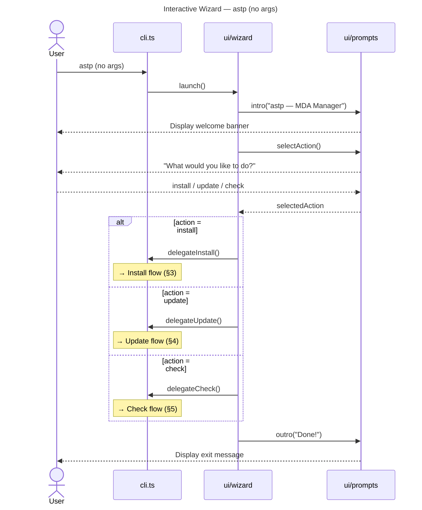
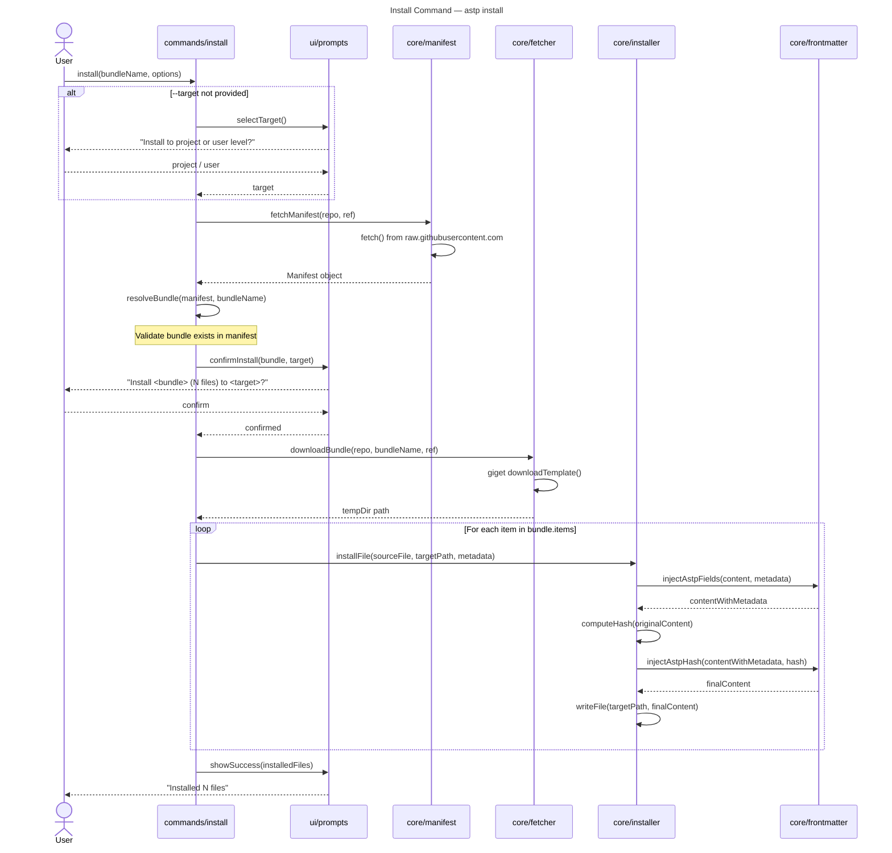
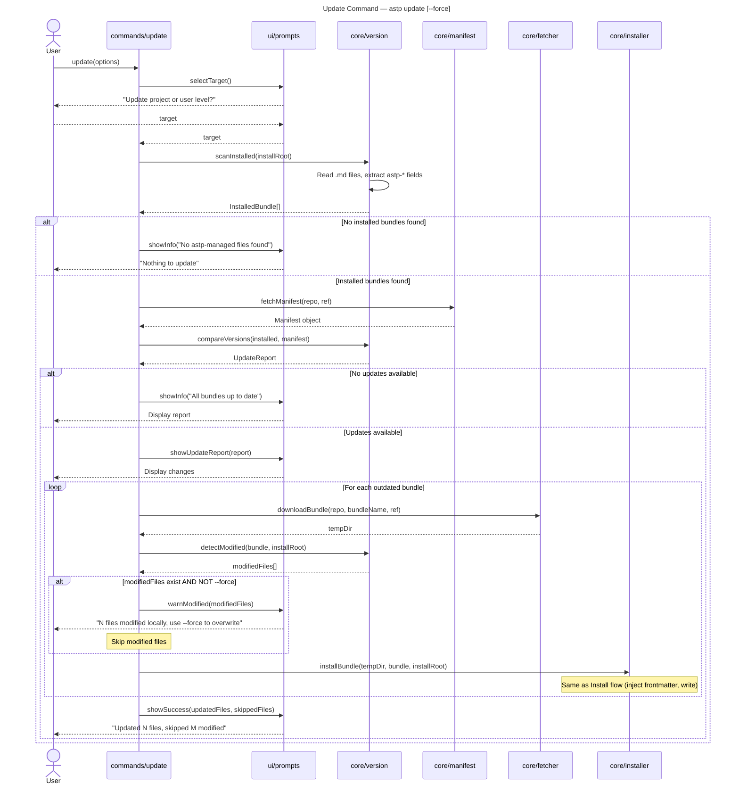
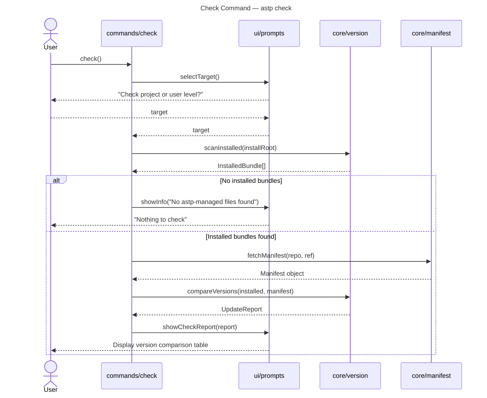
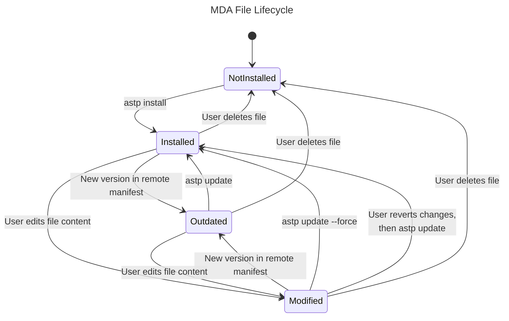

# Data Flow: astp CLI

## 1. Overview

Four user-facing flows exist in v0.1.0 [ref: ../01-research/03-open-questions.md Q11, user decision: Option 2]:

1. **Interactive wizard** — `astp` (no args): guides the user through action selection → delegates to a command flow.
2. **Install** — `astp install <bundle> [--target project|user]`: downloads and installs a bundle.
3. **Update** — `astp update [--force]`: applies available updates to installed files.
4. **Check** — `astp check`: reports available updates without modifying files.

All flows share two common operations:
- **Manifest fetch** — retrieves `manifest.json` from GitHub via native `fetch()` [ref: ../01-research/02-external-research.md §3, ADR-1].
- **Installed file scan** — reads `astp-*` frontmatter from `.md` files in the install target to determine what's installed [ref: ../01-research/03-open-questions.md Q7, user decision: Option 3].


## 2. Interactive Wizard Flow

Triggered by running `astp` with no arguments [ref: ../01-research/03-open-questions.md Q10, user decision: Option 3].



The wizard is a thin orchestration layer — it collects the user's intent and delegates to the appropriate command handler. The command handler may prompt further (e.g., target selection, bundle selection).


## 3. Install Command Flow

Triggered by `astp install <bundle> [--target project|user]` or by the wizard selecting "install."



**Key data transformations during install:**

1. **Manifest fetch**: HTTP GET → JSON parse → `Manifest` object.
2. **Bundle resolution**: `manifest.bundles[bundleName]` → `Bundle` with items list.
3. **Template download**: giget → temp directory with bundle files.
4. **Frontmatter injection**: For each file, add `astp-source`, `astp-bundle`, `astp-version`, `astp-hash` fields to YAML frontmatter. Files without frontmatter (stage definitions) get a new frontmatter block prepended [ref: ../01-research/01-codebase-analysis.md §4.5].
5. **Hash computation**: SHA-256 of the template content before `astp-*` injection (see [03-model.md](./03-model.md) §3 for details).
6. **File write**: `path.join(installRoot, item.target)` with recursive directory creation.


## 4. Update Command Flow

Triggered by `astp update [--force]` or by the wizard selecting "update."



**Modification detection** [ref: ../01-research/03-open-questions.md Q8, user decision: Option 1]:

1. Read installed file content.
2. Strip `astp-*` frontmatter fields.
3. Compute SHA-256 of the result.
4. Compare with stored `astp-hash` value from frontmatter.
5. If mismatch → file was modified by user → warn and skip (unless `--force`).


## 5. Check Command Flow

Triggered by `astp check` or by the wizard selecting "check."



**Check is read-only** — no files are downloaded or modified. It only fetches the remote manifest (a single HTTP request) and compares versions. Output format:

```
Bundle         Installed   Available   Status
base           1.0.0       1.0.0       ✓ Up to date
rdpi           1.0.0       1.2.0       ↑ Update available
```


## 6. File Lifecycle State Diagram

Each MDA file managed by `astp` transitions through these states:



**State definitions:**

| State | Condition | Detection method |
|-------|-----------|-----------------|
| **NotInstalled** | File does not exist at the expected target path, or exists without `astp-*` frontmatter. | Absence of `astp-source` field. |
| **Installed** | File exists with `astp-*` frontmatter. Content hash matches `astp-hash`. Version matches remote manifest. | `astp-hash` match + version match. |
| **Outdated** | File exists with `astp-*` frontmatter. `astp-version` is less than the remote manifest version for its bundle. | Semver comparison of `astp-version` vs manifest version. |
| **Modified** | File exists with `astp-*` frontmatter. Content hash does NOT match `astp-hash` (user edited the content). | Hash mismatch. |

A file can be both **Modified** and **Outdated** simultaneously (user modified it AND a new remote version exists). The `update` command handles this case: warn and skip unless `--force` [ref: ../01-research/03-open-questions.md Q8, user decision: Option 1].


## 7. Manifest Fetch Details

The manifest is always fetched from a fixed URL pattern:

```
https://raw.githubusercontent.com/{repo}/{ref}/src/templates/manifest.json
```

Where:
- `repo` = `fozy-labs/astp` (hardcoded in v0.1.0, configurable later)
- `ref` = `main` (default branch; future: support `--ref` flag for pinning)

This uses Node.js native `fetch()` (available in Node.js 22+) [ref: ../01-research/03-open-questions.md Q12, user decision: Node.js >= 22]. No external HTTP library needed.

**Error scenarios:**
- Network failure → show error message, suggest checking connectivity.
- 404 → manifest not found at ref, suggest checking repository.
- JSON parse error → corrupted manifest, show raw error.
- Schema validation failure → manifest version mismatch, suggest updating CLI.


## 8. Template Download Details

Templates are downloaded per-bundle using giget's `downloadTemplate()` API:

```
giget gh:{repo}/src/templates/{bundleName}#{ref}
```

This downloads the specific bundle subdirectory as a tarball extract to a temporary directory. [ref: ../01-research/02-external-research.md §3]

**giget options used:**
- `dir`: OS temp directory (cleaned up after install completes).
- `preferOffline`: `true` (use cache when available).
- `auth`: from `GIGET_AUTH` env variable (for private repos or rate limit avoidance).

**Rate limit mitigation:** GitHub allows 60 unauthenticated requests/hour. The manifest fetch (1 request) + giget download (1 tarball per bundle) = 2-3 requests per CLI invocation. Well within limits for normal use. For CI environments, set `GIGET_AUTH` with a GitHub token [ref: ../01-research/02-external-research.md §3, Pitfalls §4].
