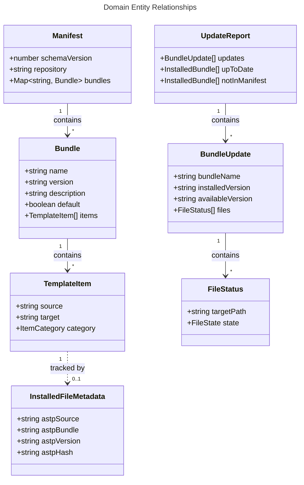

# Domain Model: astp CLI

## 1. Overview

The domain model centers around three concepts:
- **Manifest** — the remote source of truth describing available bundles and their contents.
- **Bundle** — a named, versioned collection of MDA template files.
- **Installed file metadata** — `astp-*` frontmatter fields injected into each installed file for local tracking.

The manifest defines what's available; the frontmatter defines what's installed. Version comparison between the two drives the update and check flows.


## 2. Entity Relationships




## 3. TypeScript Interfaces

### 3.1 Remote Manifest Types

```typescript
/** Remote manifest.json schema — the source of truth for available templates. */
interface Manifest {
  /** Schema version (integer). CLI checks compatibility before processing. */
  schemaVersion: number;
  /** Source repository in "owner/repo" format. */
  repository: string;
  /** Available bundles, keyed by bundle name. */
  bundles: Record<string, Bundle>;
}

/** A named, versioned collection of template files. */
interface Bundle {
  /** Bundle identifier (matches the key in Manifest.bundles). */
  name: string;
  /** Semver version string (e.g., "1.0.0"). */
  version: string;
  /** Human-readable description for display in prompts. */
  description: string;
  /** Whether this bundle is pre-selected by default in the interactive wizard. */
  default: boolean;
  /** Files included in this bundle. */
  items: TemplateItem[];
}

/** A single template file within a bundle. */
interface TemplateItem {
  /** Path relative to src/templates/ (e.g., "rdpi/agents/rdpi-approve.agent.md"). */
  source: string;
  /** Path relative to install root (e.g., "agents/rdpi-approve.agent.md"). */
  target: string;
  /** MDA file category for display grouping. */
  category: ItemCategory;
}

type ItemCategory = 'agent' | 'skill' | 'instruction' | 'stage-definition';
```

### 3.2 Install Target Types

```typescript
/** Where files are installed. */
type InstallTargetType = 'project' | 'user';

/** Resolved install target with absolute paths. */
interface InstallTarget {
  type: InstallTargetType;
  /** Absolute path to the install root directory. */
  rootDir: string;
}
```

### 3.3 Installed File Metadata Types

```typescript
/**
 * Metadata extracted from astp-* frontmatter fields of an installed file.
 * These fields are injected by the CLI during install/update.
 */
interface InstalledFileMetadata {
  /** Source repository ("fozy-labs/astp"). Maps to `astp-source` frontmatter field. */
  source: string;
  /** Bundle name ("rdpi", "base"). Maps to `astp-bundle` field. */
  bundle: string;
  /** Bundle version at install/update time ("1.0.0"). Maps to `astp-version` field. */
  version: string;
  /** SHA-256 hash of template content (without astp-* fields). Maps to `astp-hash` field. */
  hash: string;
}

/** An installed file with its metadata and filesystem location. */
interface InstalledFile {
  /** Absolute path to the installed file. */
  filePath: string;
  /** Path relative to install root (matches manifest item.target). */
  relativePath: string;
  /** Parsed astp-* metadata from frontmatter. */
  metadata: InstalledFileMetadata;
}

/** Files grouped by bundle after scanning the install target. */
interface InstalledBundle {
  bundleName: string;
  version: string;
  files: InstalledFile[];
}
```

### 3.4 Version Comparison Types

```typescript
/** Result of comparing installed state against remote manifest. */
interface UpdateReport {
  /** Bundles with newer versions available. */
  updates: BundleUpdate[];
  /** Bundles that are up to date. */
  upToDate: InstalledBundle[];
  /** Installed bundles not found in remote manifest (removed upstream). */
  notInManifest: InstalledBundle[];
}

/** Details about an available update for a single bundle. */
interface BundleUpdate {
  bundleName: string;
  installedVersion: string;
  availableVersion: string;
  /** Per-file status (modified, unmodified, new, removed). */
  files: FileStatus[];
}

interface FileStatus {
  /** Path relative to install root. */
  targetPath: string;
  state: FileState;
}

type FileState =
  | 'unmodified'       // hash matches astp-hash — safe to overwrite
  | 'modified'         // hash differs from astp-hash — user edited the file
  | 'new'              // file exists in new version but not locally installed
  | 'removed';         // file was in old version but removed from new version
```


## 3. Frontmatter Metadata Schema

### 3.1 Injected Fields

The CLI injects four `astp-*` fields into each installed file's YAML frontmatter [ref: ../01-research/03-open-questions.md Q7, user decision: Option 3 — metadata in frontmatter]:

| Field | Type | Example | Purpose |
|-------|------|---------|---------|
| `astp-source` | string | `fozy-labs/astp` | Identifies the source repository |
| `astp-bundle` | string | `rdpi` | Identifies the bundle this file belongs to |
| `astp-version` | string | `1.0.0` | Bundle version at install/update time |
| `astp-hash` | string | `a1b2c3d4...` | SHA-256 hash for modification detection |

### 3.2 Frontmatter Examples

**Agent file (has existing frontmatter)**

Template source in `src/templates/`:
```yaml
---
name: rdpi-approve
description: "ONLY for RDPI pipeline."
user-invocable: false
tools: [search, read, edit, web, execute, vscode]
---
```

After installation:
```yaml
---
name: rdpi-approve
description: "ONLY for RDPI pipeline."
user-invocable: false
tools: [search, read, edit, web, execute, vscode]
astp-source: fozy-labs/astp
astp-bundle: rdpi
astp-version: 1.0.0
astp-hash: e3b0c44298fc1c149afbf4c8996fb924...
---
```

Existing fields are preserved. `astp-*` fields are appended at the end of the frontmatter block. [ref: ../01-research/01-codebase-analysis.md §4.1]

**Stage definition file (no existing frontmatter)**

Template source in `src/templates/`:
```markdown
# Stage: 01-Research
...content...
```

After installation:
```yaml
---
astp-source: fozy-labs/astp
astp-bundle: rdpi
astp-version: 1.0.0
astp-hash: 7d865e959b2466918c9863afca942d0f...
---
# Stage: 01-Research
...content...
```

A new frontmatter block is created and prepended to the file content. [ref: ../01-research/01-codebase-analysis.md §4.5 — stage definition files have no frontmatter]

### 3.3 Hash Computation

The `astp-hash` field enables modification detection [ref: ../01-research/03-open-questions.md Q8, user decision: Option 1]:

**At install time:**
1. Read the template source file content (from `src/templates/`).
2. Compute SHA-256 hash of this content.
3. Store the hash as `astp-hash` in the installed file's frontmatter.

**At check/update time:**
1. Read the installed file.
2. Strip all `astp-*` fields from frontmatter.
3. If stripping `astp-*` fields leaves an empty frontmatter block AND the original template had no frontmatter (detectable because only `astp-*` fields exist), also remove the frontmatter delimiters (`---`).
4. Compute SHA-256 of the result.
5. Compare with stored `astp-hash`.
6. Match → file unmodified. Mismatch → file modified by user.

This approach hashes the "original template content" and compares against the "current content minus astp metadata," ensuring that the hash comparison is immune to the metadata injection itself.


## 4. Manifest Schema

The `manifest.json` lives at `src/templates/manifest.json` and is the contract between the CLI and the template repository [ref: ../01-research/03-open-questions.md Q9, ADR-5].

### 4.1 Schema Definition

```json
{
  "schemaVersion": 1,
  "repository": "fozy-labs/astp",
  "bundles": {
    "base": {
      "name": "base",
      "version": "1.0.0",
      "description": "Base skill for VSCode Copilot agent orchestration",
      "default": true,
      "items": [
        {
          "source": "base/skills/orchestrate/SKILL.md",
          "target": "skills/orchestrate/SKILL.md",
          "category": "skill"
        }
      ]
    },
    "rdpi": {
      "name": "rdpi",
      "version": "1.0.0",
      "description": "Full RDPI pipeline — agents, instructions, and stage definitions",
      "default": false,
      "items": [
        {
          "source": "rdpi/agents/RDPI-Orchestrator.agent.md",
          "target": "agents/RDPI-Orchestrator.agent.md",
          "category": "agent"
        },
        {
          "source": "rdpi/agents/rdpi-approve.agent.md",
          "target": "agents/rdpi-approve.agent.md",
          "category": "agent"
        },
        {
          "source": "rdpi/instructions/thoughts-workflow.instructions.md",
          "target": "instructions/thoughts-workflow.instructions.md",
          "category": "instruction"
        },
        {
          "source": "rdpi/rdpi-stages/01-research.md",
          "target": "rdpi-stages/01-research.md",
          "category": "stage-definition"
        }
      ]
    }
  }
}
```

*(Abbreviated — full manifest will list all 22 items.)*

### 4.2 Schema Versioning

The `schemaVersion` field is an integer. The CLI checks it before processing:
- If `schemaVersion` equals the supported version → proceed.
- If `schemaVersion` is greater → warn user to update the CLI.
- If `schemaVersion` is less → apply backward-compatible handling (future consideration).

For v0.1.0, the supported `schemaVersion` is `1`.

### 4.3 Manifest Conventions

- `source` paths are relative to `src/templates/` and follow the pattern `<bundleName>/<category>/<filename>`.
- `target` paths are relative to the install root and equal `source` with the bundle name prefix stripped.
- `version` follows semver: major = breaking changes (files renamed/removed, directory structure change), minor = new files added, patch = content fixes.
- `repository` defines the giget source: `gh:{repository}/src/templates/{bundleName}`.


## 5. Invariants and Business Rules

1. **Every installed file has `astp-*` frontmatter.** The FileInstaller always injects all four `astp-*` fields. Files without them are not considered astp-managed.

2. **Bundle version is uniform across all files in a bundle.** All files installed from bundle version `1.0.0` have `astp-version: 1.0.0`. There is no per-file versioning — the bundle is the unit of versioning [ref: ../01-research/03-open-questions.md Q3, ADR-2].

3. **`astp-hash` is computed from the template source content.** It does not include `astp-*` fields. This makes hash comparison deterministic regardless of when or how many times the file was installed.

4. **`astp-bundle` groups installed files.** The VersionManager uses this field to group files by bundle during scanning. All files with the same `astp-bundle` value are treated as a unit for version comparison.

5. **Manifest `schemaVersion` must be checked before processing.** The CLI must not silently process a manifest with an unsupported schema version.

6. **Existing non-astp frontmatter fields are preserved.** The FrontmatterHandler must not modify, reorder, or remove any frontmatter fields that don't start with `astp-`. This ensures AI agent parsers continue to read the files correctly [ref: ../01-research/01-codebase-analysis.md §4].

7. **Modified files are never silently overwritten.** The update command must warn about modified files and skip them unless `--force` is specified [ref: ../01-research/03-open-questions.md Q8, user decision: Option 1].
