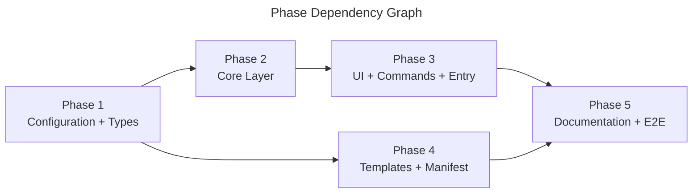

## Overview

Implements the approved design for `astp` — a Node.js CLI managing MDA files via template bundles fetched from GitHub. The plan decomposes 12 source modules (4 layers), 22 template files, configuration setup, and 46 test cases into 5 phases, each leaving the project in a compilable state.

## Phase Map

## Phase Summary

| Phase | Name | Tasks | Dependencies | Parallelizable | Complexity | Files | Verification |
|-------|------|-------|--------------|----------------|------------|-------|--------------|
| 1 | Configuration + Types | 6 | None | No | Medium | 1 modify + 6 create | `npm install && npm run ts-check` |
| 2 | Core Layer | 10 | Phase 1 | Yes (∥ Phase 4) | High | 10 create | `npm run ts-check && npm run test` |
| 3 | UI + Commands + Entry | 9 | Phase 2 | No | High | 9 create | `npm run ts-check && npm run test` |
| 4 | Templates + Manifest | 4 | Phase 1 | Yes (∥ Phase 2) | Low | 24 create | JSON valid, 22 template files present |
| 5 | Documentation + E2E | 4 | Phases 3, 4 | No | Medium | 5 create | Full test suite passes |

## Execution Rules

- Phases without dependencies on incomplete phases may be executed in parallel (Phase 2 ∥ Phase 4).
- Sequential phases (1→2→3, 1→4) require verification before proceeding.
- Every phase must leave the project in a compilable state (`npm run ts-check` passes).
- Tests must pass at end of each phase that introduces test files (`npm run test`).
- Phase 4 (templates) does not affect TypeScript compilation — verified by file existence and JSON validity only.

## Next Steps

Proceeds to implementation after human review. Each plan phase becomes a coder task in the `04-implement` stage.

## Quality Review

> Full re-review (Round 2) as requested. All 5 phase files, 7 design documents, TASK.md, and previous REVIEW.md read in full. All file paths verified against current repository state. All 46 test cases individually cross-referenced.

### Previous Review History

| Round | Issues Found | Outcome |
|-------|-------------|---------|
| Round 0 (initial) | 2 issues (Medium, Low) + 1 user feedback (barrel pattern) | All 3 resolved in Redraft Round 1 |
| Round 1 (post-redraft) | 1 issue (Low — Task 2.8 note cosmetic) | Carried forward, mitigating factor confirmed |
| **Round 2 (full re-review)** | **0 new issues. 1 Low carried from Round 1** | See below |

### Checklist

| # | Criterion | Status | Notes |
|---|-----------|--------|-------|
| 1 | Every design component mapped to task(s) | PASS | All 12 modules from 01-architecture.md §4 verified: Entry→3.6, InstallCommand→3.3, UpdateCommand→3.4, CheckCommand→3.5, Wizard→3.2, Prompts→3.1, ManifestReader→2.2, TemplateFetcher→2.3, FileInstaller→2.4, VersionManager→2.5, FrontmatterHandler→2.1, Types→1.6. Template layout §6 covered by Phase 4 (Tasks 4.1–4.4). Extension points §8 correctly omitted (out of v0.1.0 scope). |
| 2 | File paths concrete and verified | PASS | All 33 tasks verified against repo. Existing files: `package.json` (modify), `.github/agents/` (16 agents), `.github/skills/orchestrate/SKILL.md`, `.github/instructions/thoughts-workflow.instructions.md`, `.github/rdpi-stages/` (4 files) — all confirmed present as Phase 4 copy sources. `src/templates/` exists and is empty (planned for population). Creation targets (`src/core/`, `src/ui/`, `src/commands/`, `src/types/`, `tests/e2e/`) are all new directories — correct. |
| 3 | Phase dependencies correct | PASS | P1→P2→P3→P5 and P1→P4→P5 match 01-architecture.md §5 import graph. No circular deps. Mermaid `graph LR` edges match declared `## Dependencies` in each phase file. P2∥P4 parallelism valid — both depend only on P1, no cross-dependency. |
| 4 | Verification criteria per phase | PASS | Phase 1: install + ts-check + ts-check:tests + lint + format:check. Phase 2: ts-check + ts-check:tests + test + specific test IDs. Phase 3: ts-check + ts-check:tests + test + command tests + --help check. Phase 4: JSON validity + file counts + source→target mapping. Phase 5: README + E2E compile + build + full suite + ts-check + lint + format:check. |
| 5 | Each phase leaves project compilable | PASS | Phase 1: tsconfig + types → compilable. Phase 2: core modules import Phase 1 types only → compilable. Phase 3: commands/UI import Phase 2 core → compilable. Phase 4: markdown/JSON — no TS compilation. Phase 5: E2E tests + README → compilable. |
| 6 | No vague tasks — exact files and changes | PASS | All 33 tasks specify exact file path(s), action (Create/Modify/Verify), complexity, and detailed implementation specification. No "improve X" or "refactor Y" tasks. Task 1.6 explicitly lists both files with separate detail sections. Task 5.4 is a verification-only task (no file output) — correctly marked. |
| 7 | Design traceability (`[ref: ...]`) on all tasks | PASS | Every task includes `[ref: ...]` links to specific design doc sections. Verified coverage: 01-architecture.md (§4, §5, §6, Constraints), 02-dataflow.md (§2–§5), 03-model.md (§3, §4, §5), 04-decisions.md (ADR-1 through ADR-6), 05-usecases.md (UC-1 through UC-4), 06-testcases.md (T01–T46), 07-docs.md, 08-risks.md (R1, R2, R4, R9, R14). |
| 8 | Parallel/sequential correctly marked | PASS | Summary table Parallelizable column: P1=No, P2=Yes (∥P4), P3=No, P4=Yes (∥P2), P5=No. Matches Mermaid graph. Each phase's `## Execution` section is consistent: P1 "Sequential — must complete before any other phase", P2 "Sequential after Phase 1", P3 "Sequential after Phase 2", P4 "Parallel with Phase 2 and Phase 3", P5 "Sequential — must complete after both Phase 3 and Phase 4". |
| 9 | Complexity estimates present (L/M/H) | PASS | All 33 tasks have explicit estimates. Distribution: Phase 1: M,L,L,L,L,M. Phase 2: H,M,L,H,H,M,M,M,M,L. Phase 3: M,M,H,H,M,L,M,M,M. Phase 4: M,L,L,L. Phase 5: M,M,H,L. High assigned to core business logic (frontmatter, installer, version, install cmd, update cmd, E2E tests) — reasonable. |
| 10 | Documentation tasks proportional to existing docs/demos | PASS | `docs/` empty, no `apps/demos/`. Plan: 2 doc files — root `README.md` (7 sections, Task 5.1) and `src/templates/README.md` (author guide, Task 4.4). Matches 07-docs.md specification exactly. Not over/under-specified. |
| 11 | Mermaid dependency graph present | PASS | Phase Map `graph LR` with 5 nodes (P1–P5) and 5 edges: P1→P2, P1→P4, P2→P3, P3→P5, P4→P5. Valid Mermaid syntax. Title present. |
| 12 | Phase summary table complete | PASS | 8 columns: Phase, Name, Tasks, Dependencies, Parallelizable, Complexity, Files, Verification. All 5 rows with correct data. Task counts: 6+10+9+4+4=33. File counts: (1m+6c)+10c+9c+24c+5c = 1 modify + 54 create. |

### Test Case Traceability (T01–T46)

Full individual mapping verified — no gaps, no duplicates:

| Test IDs | Count | Plan Task | Test File |
|----------|-------|-----------|-----------|
| T01–T07, T25, T42 | 9 | 2.6 | `src/core/__tests__/frontmatter.test.ts` |
| T12–T15, T18–T19, T28–T30 | 9 | 2.7 | `src/core/__tests__/manifest.test.ts` |
| T16–T17, T23–T24, T43–T46 | 8 | 2.8 | `src/core/__tests__/installer.test.ts` |
| T08–T11, T20–T22, T26–T27 | 9 | 2.9 | `src/core/__tests__/version.test.ts` |
| T40 | 1 | 3.7 | `src/commands/__tests__/install.test.ts` |
| T41 | 1 | 3.8 | `src/commands/__tests__/update.test.ts` |
| T31–T32, T38 | 3 | 5.3 | `tests/e2e/install.test.ts` |
| T33–T34 | 2 | 5.3 | `tests/e2e/check.test.ts` |
| T35–T37, T39 | 4 | 5.3 | `tests/e2e/update.test.ts` |
| **Total** | **46** | | |

Task 2.10 (`fetcher.test.ts`) correctly declares additional plan-level tests outside the T01–T46 set.

### Barrel Pattern Verification

- `src/types/index.ts` (Task 1.6): Barrel file — re-exports `resolveTarget` from `./resolve-target.ts` + exports type declarations (interfaces/types are inert, not logic). No executable code.
- `src/types/resolve-target.ts` (Task 1.6): Contains the `resolveTarget()` function + related types. Executable logic correctly separated from barrel.
- No other `index.ts` files planned. Core, commands, and UI modules use direct imports per 01-architecture.md §5.

### Completeness Assessment

Implementing all 5 phases produces a fully working CLI:
1. **Phase 1** → buildable project with types and toolchain
2. **Phase 2** → all business logic (frontmatter, manifest, fetcher, installer, version) with unit/integration tests
3. **Phase 3** → assembled CLI binary: `src/cli.ts` with Commander, 3 commands, wizard, prompts. `npm run build` → `dist/cli.js`
4. **Phase 4** → 22 template files + manifest ready for distribution
5. **Phase 5** → README, E2E tests, full CI verification

The `package.json` `bin.astp` → `./dist/cli.js` entry (Task 1.1) + shebang in `src/cli.ts` (Task 3.6) = publishable npm CLI package.

### Documentation Proportionality

`docs/` is empty. No `apps/demos/`. Plan includes exactly 2 documentation files: root `README.md` (Task 5.1, 7 sections per 07-docs.md) and `src/templates/README.md` (Task 4.4, template author guide per 07-docs.md). Proportional for a greenfield CLI — not over-specified, not under-specified.

### Issues Found

1. **Task 2.8 note references `src/types/index.ts` instead of `src/types/resolve-target.ts`** *(carried from Round 1)*
   - **What's wrong**: 02-phase.md Task 2.8 note says "T16-T17 test `resolveTarget()` exported from `src/types/index.ts`". After the Round 0 redraft, `resolveTarget()` was moved to `src/types/resolve-target.ts`.
   - **Where**: 02-phase.md, Task 2.8, final note line
   - **What's expected**: Note could reference `src/types/resolve-target.ts` for precision, or clarify that tests import via the barrel.
   - **Mitigating factor**: `index.ts` is a barrel that re-exports `resolveTarget()`. Tests SHOULD import from the barrel (public API), making the note technically correct for import purposes. No implementation impact whatsoever.
   - **Severity**: Low — cosmetic only. Does not affect implementation correctness or compilability.
