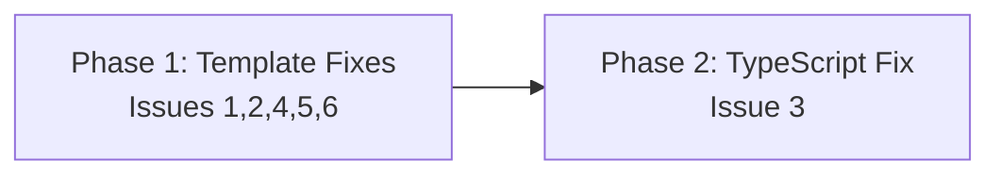

## Overview

Implement 6 surgical fixes across 5 files: 4 template text edits and 1 TypeScript code change. All changes have exact before/after text specified in [the design](../02-design/01-architecture.md).

## Phase Map

## Phase Summary

| Phase | Name | Type | Dependencies | Complexity | Files |
|-------|------|------|--------------|------------|-------|
| 1 | Template Fixes | Sequential | None | Low | 4 template files |
| 2 | TypeScript Fix | Sequential | Phase 1 | Low | 1 `.ts` file |

## Execution Rules
- Phase 2 depends on Phase 1 only for orderly verification — there is no code dependency.
- Every phase must leave the project in a compilable state.
- Template-only phases skip `npm run ts-check`; the TypeScript phase requires it.

## Next Steps

Proceeds to implementation after human review.

## Quality Review

### Checklist
| # | Criterion | Status | Notes |
|---|-----------|--------|-------|
| 1 | Every design component mapped to task(s) | PASS | All 6 issues from `01-architecture.md` have corresponding tasks: Issue 1→T1.1, Issue 2→T1.2, Issue 3→T2.1+T2.2, Issue 4→T1.3, Issue 5→T1.4, Issue 6→T1.5 |
| 2 | File paths concrete and verified | PASS | All 5 files confirmed to exist in the repository: `thoughts-workflow.instructions.md`, `rdpi-codebase-researcher.agent.md`, `prompts.ts`, `RDPI-Orchestrator.agent.md`, `rdpi-approve.agent.md` |
| 3 | Phase dependencies correct | PASS | Issues 4+6 (Tasks 1.3, 1.5) share `RDPI-Orchestrator.agent.md` and are correctly placed in the same phase. P2→P1 dependency is orderly-verification only; no circular deps |
| 4 | Verification criteria per phase | PASS | Phase 1 has 9 checks (T1a/b, T2, T4a/b, T5, T6a/b, flow coherence). Phase 2 has 2 checks (grep for `hint:`, `npm run ts-check`) |
| 5 | Each phase leaves project compilable | PASS | Phase 1 is template-only (no TS compilation affected). Phase 2 includes `npm run ts-check` as verification |
| 6 | No vague tasks — exact files and changes | PASS | Every task specifies exact file path, exact find/replace text matching the design spec. No ambiguous "improve X" language |
| 7 | Design traceability (`[ref: ...]`) on all tasks | PASS | All 7 tasks carry `[ref: ../02-design/01-architecture.md#issue-N]` references to the corresponding design section |
| 8 | Parallel/sequential correctly marked | PASS | Both phases marked Sequential. Correct: Phase 1 has two tasks sharing one file (T1.3, T1.5 → Orchestrator); Phase 2 has two tasks sharing one file (T2.1, T2.2 → prompts.ts). Tasks on independent files within Phase 1 could theoretically be parallel, but sequential is conservative and acceptable for this scope |
| 9 | Complexity estimates present (L/M/H) | PARTIAL | Phase-level complexity (Low) is present in the summary table. Per-task complexity annotations are missing from individual task definitions in phase files |
| 10 | Documentation tasks proportional to existing docs/demos | PASS | No documentation tasks planned. `docs/` is empty, no `apps/demos/` exists. These are internal template and code fixes — correct omission |
| 11 | Mermaid dependency graph present | PASS | `graph LR` with P1→P2 dependency present in README. Matches actual phase dependencies (P2 requires P1) |
| 12 | Phase summary table complete | PASS | Table includes Phase number, Name, Type, Dependencies, Complexity, Files for both phases |

### Documentation Proportionality
N/A — no documentation tasks in the plan. `docs/` is empty and no `apps/demos/` directory exists. All changes are internal template text edits and one TypeScript code fix. No external documentation impact.

### Issues Found
1. **Per-task complexity estimates missing**
   - **What's wrong**: Individual tasks in `01-template-fixes.md` and `02-typescript-fix.md` lack explicit `Complexity: Low` annotations. Only the phase-level summary table carries the "Low" estimate.
   - **Where**: `03-plan/01-template-fixes.md` Tasks 1.1–1.5, `03-plan/02-typescript-fix.md` Tasks 2.1–2.2
   - **What's expected**: Each task definition should include a complexity field (e.g., `- **Complexity**: Low`)
   - **Severity**: Low — all tasks are trivially text replacements, and the phase-level estimate makes the intent clear. Cosmetic gap only.
