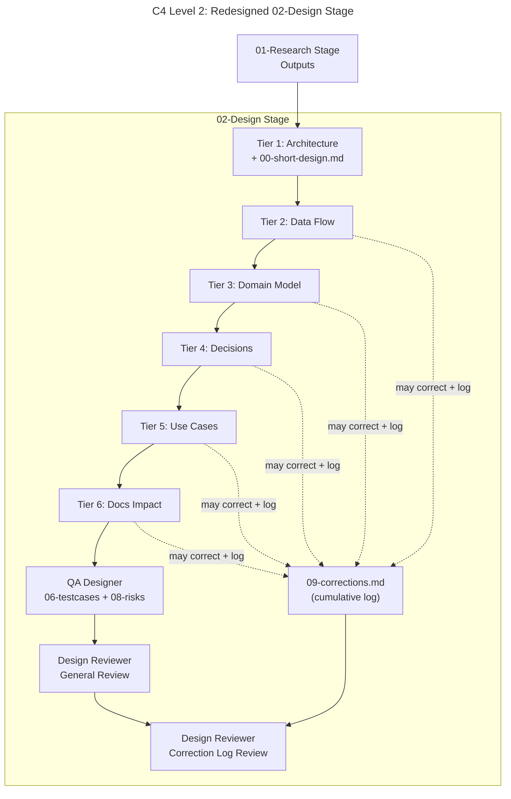
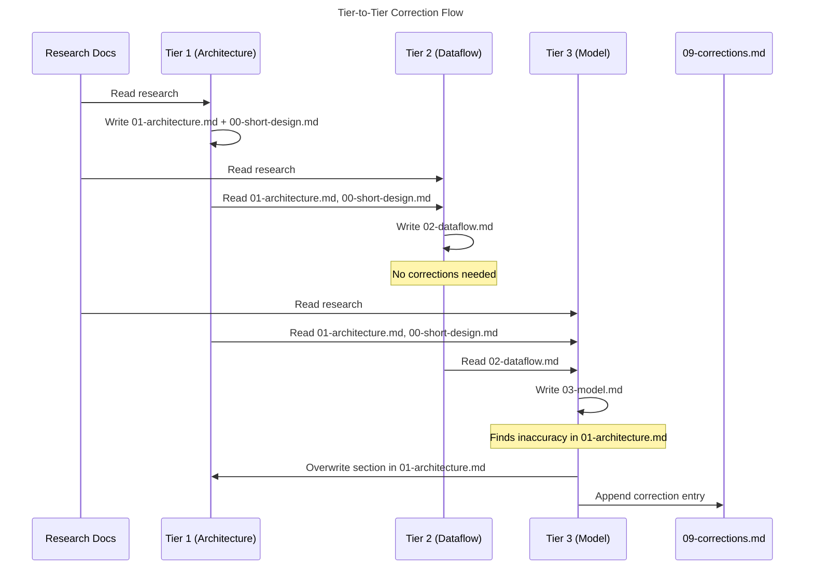

# Architecture: Design Stage Per-Document Tiers

## Overview

The redesigned `02-design` stage replaces the current 2-phase architect model with per-document designer tiers, a cumulative correction mechanism, and a structured short-design prologue. Each design document (`01-architecture` through `07-docs`) becomes its own phase executed by `rdpi-architect`, ordered from most-defining to least-defining. After all designer tiers, `rdpi-qa-designer` produces test/risk documents, followed by two `rdpi-design-reviewer` passes. [ref: ../01-research/03-open-questions.md#Q1]

## Component Design

### C4 Level 2 — Design Stage Container



### C4 Level 3 — Tier Internal Structure

Each designer tier is an `rdpi-architect` invocation with a focused phase prompt. The tier:

1. **Reads**: all research docs (`../01-research/`), all previously produced design docs, `00-short-design.md`, `09-corrections.md` (if exists) [ref: ../01-research/01-codebase-analysis.md#5. Data Flow Between Phases]
2. **Writes**: its own assigned design document
3. **May overwrite**: any earlier tier's document (in-place) when finding inaccuracies [ref: ../01-research/03-open-questions.md#Q2]
4. **Appends to**: `09-corrections.md` when overwriting an earlier document [ref: ../01-research/03-open-questions.md#Q3]

### New Phase Structure

| Phase | Agent | Primary Output | Additional Outputs | Depends on |
|-------|-------|---------------|-------------------|------------|
| 1 | `rdpi-architect` | `01-architecture.md` | `00-short-design.md` | — |
| 2 | `rdpi-architect` | `02-dataflow.md` | corrections (if any) | 1 |
| 3 | `rdpi-architect` | `03-model.md` | corrections (if any) | 2 |
| 4 | `rdpi-architect` | `04-decisions.md` | corrections (if any) | 3 |
| 5 | `rdpi-architect` | `05-usecases.md` | corrections (if any) | 4 |
| 6 | `rdpi-architect` | `07-docs.md` | corrections (if any) | 5 |
| 7 | `rdpi-qa-designer` | `06-testcases.md`, `08-risks.md` | — | 6 |
| 8 | `rdpi-design-reviewer` | Updates `README.md` (general review) | — | 7 |
| 9 | `rdpi-design-reviewer` | Updates `README.md` (correction log review) | — | 8 |

**Total: 9 phases.** This exceeds the current 6-phase hard cap. See ADR-7 in `04-decisions.md` for resolution. [ref: ../01-research/01-codebase-analysis.md#1. Design Stage Skill]

### Tier Ordering Rationale

The ordering follows a "most-defining first" principle:

1. **Architecture** — defines component boundaries, module structure, public API. Everything else derives from this. [ref: ../01-research/01-codebase-analysis.md#2. Architect Agent]
2. **Data Flow** — defines how data moves through the architecture. Depends on knowing the components.
3. **Domain Model** — defines entities and types. Depends on architecture for module boundaries, on dataflow for lifecycle.
4. **Decisions** — formalizes choices already implicit in architecture/dataflow/model. Depends on all three to enumerate actual decisions made.
5. **Use Cases** — demonstrates the design with concrete scenarios. Depends on architecture + model + decisions.
6. **Docs Impact** — describes documentation needs. Depends on all design documents to assess scope. Must be last designer tier to have full picture for proportionality. [ref: ../01-research/01-codebase-analysis.md#2. Architect Agent — docs.md critical rule]

## Module Boundaries

### Files Modified by This Redesign

| File | Change Type | Scope |
|------|-------------|-------|
| `templates/rdpi/skills/rdpi-02-design/SKILL.md` | Major rewrite | Phase structure, roles table, phase prompt guidelines, scaling rules |
| `templates/rdpi/agents/rdpi-architect.agent.md` | Update | Add `00-short-design.md` capability, correction mechanism rules |
| `templates/rdpi/agents/rdpi-design-reviewer.agent.md` | Update | Add correction log review pass, update checklist |
| `templates/rdpi/skills/rdpi-01-research/SKILL.md` | Minor update | Add `astp-version` to Output Conventions |
| `templates/rdpi/skills/rdpi-03-plan/SKILL.md` | Minor update | Add `astp-version` to Output Conventions |
| `templates/rdpi/skills/rdpi-04-implement/SKILL.md` | Minor update | Add `astp-version` to Output Conventions |

### Responsibility Zones

- **Design skill** (`rdpi-02-design/SKILL.md`): Defines tiers, phase structure, correction rules, scaling rules. This is the primary artifact.
- **Architect agent**: Executes tier work. Receives correction authority via skill rules. Produces `00-short-design.md` in tier 1.
- **Design reviewer agent**: Two-pass review. General review (existing checklist + new items) + correction log verification.
- **Stage creator**: Unchanged — reads the updated skill and generates PHASES.md accordingly. [ref: ../01-research/03-open-questions.md#Q11]

## 00-short-design.md Specification

Produced by tier 1 (`rdpi-architect`) alongside `01-architecture.md`. [ref: ../01-research/03-open-questions.md#Q6]

### Format

```markdown
---
title: "Short Design: <Feature Name>"
date: <YYYY-MM-DD>
stage: 02-design
role: rdpi-architect
---

## Direction
<2–3 paragraphs: high-level design direction. What approach was chosen and why.
Must reference research findings.>

## Key Decisions
- <Decision 1 — one sentence + research ref>
- <Decision 2>
- <Decision 3>
<Up to 7 decisions. These are preliminary — ADR-level detail comes in 04-decisions.md.>

## Scope Boundaries
### In Scope
- <item>
### Out of Scope
- <item>

## Research References
- [Research summary](../01-research/README.md) — <what was found>
- [Key finding](../01-research/01-codebase-analysis.md#section) — <relevance>
<Brief list linking to research documents that inform this design. 3–5 refs max.>
```

**Constraints**: 1–2 pages maximum. Must not duplicate `01-architecture.md` content — provides direction, not component details. [ref: ../01-research/03-open-questions.md#Q10]

## Correction Mechanism

### Rules (to be encoded in design skill)

1. **Tier 1** cannot correct anything (nothing precedes it).
2. **Tiers 2–6** MAY overwrite earlier tier documents in-place when they discover inaccuracies. [ref: ../01-research/03-open-questions.md#Q2]
3. Every overwrite MUST be logged in `09-corrections.md` with a table row: `| Tier | File Modified | Section | Original | Corrected | Rationale |`. [ref: ../01-research/03-open-questions.md#Q3]
4. Corrections must be factual fixes (contradictions, incorrect references, stale assumptions), NOT stylistic changes or opinion-based rewrites.
5. If a tier has no corrections to make, it does not touch `09-corrections.md`.
6. `09-corrections.md` is created by the first tier that needs to make a correction. If no corrections occur across all tiers, the file does not exist.

### 09-corrections.md Format

```markdown
---
title: "Correction Log"
date: <YYYY-MM-DD>
stage: 02-design
role: rdpi-architect
---

# Correction Log

| Tier | File Modified | Section | Original | Corrected | Rationale |
|------|--------------|---------|----------|-----------|-----------|
| 3 | 01-architecture.md | Component X | "uses sync API" | "uses async API" | Model analysis revealed async lifecycle |
```

## Design Reviewer Integration

### Pass 1 — General Review (Phase 8)

Existing quality checklist (10 items) plus new items: [ref: ../01-research/01-codebase-analysis.md#4. Design Reviewer Agent]

- [ ] `00-short-design.md` exists, is within 1–2 pages, and aligns with architecture
- [ ] Correction log entries (if any) are factual, not stylistic
- [ ] Corrected documents reflect the logged corrections accurately

### Pass 2 — Correction Log Review (Phase 9)

Dedicated to `09-corrections.md` verification: [ref: ../01-research/03-open-questions.md#Q7]

- If `09-corrections.md` exists:
  - Each entry's "Original" matches what was actually in the file before correction (cross-reference via git diff or content inspection)
  - Each entry's "Corrected" matches what is currently in the file
  - No correction introduced a new inconsistency with other documents
  - Rationale is grounded in research or earlier design documents
- If `09-corrections.md` does not exist:
  - Verify that no obvious inconsistencies exist between documents that should have been caught
  - Confirm this is legitimate (simple/aligned feature) not an oversight

Both passes update the same `README.md`. Pass 2 appends a `### Correction Log Review` subsection to the Quality Review section.

## astp-version in Stage README.md

### Design

All four stage skills' Output Conventions sections add `astp-version` to their README.md frontmatter field list. [ref: ../01-research/03-open-questions.md#Q12, Q13]

| Stage | Current README.md Fields | New Fields |
|-------|-------------------------|------------|
| 01-research | `(title, date, status, feature)` | `(title, date, status, feature, astp-version)` |
| 02-design | `(title, date, status, feature, research)` | `(title, date, status, feature, research, astp-version)` |
| 03-plan | `(title, date, status, feature, research, design)` | `(title, date, status, feature, research, design, astp-version)` |
| 04-implement | `(title, date, status, feature, plan)` | `(title, date, status, feature, plan, astp-version)` |

[ref: ../01-research/02-supporting-infrastructure.md#5. Stage Skills — README.md Frontmatter Comparison]

**Value source**: The `astp-version` value is already injected into installed template files' frontmatter by the CLI at install time. [ref: ../01-research/02-supporting-infrastructure.md#3. Manifest — Bundle Version] The stage creator reads its own installed agent file's frontmatter (or any co-installed file) to obtain the value. [ref: ../01-research/03-open-questions.md#Q8]

**Field naming**: Uses `astp-version` (not `pipeline-version`) to match the existing CLI injection convention. The `research-reviewer` agent template that expects `pipeline-version` will need a corresponding update to use `astp-version` instead. [ref: ../01-research/03-open-questions.md#Q13]

## Scaling Rules Update

The redesigned scaling rules for the design skill replace the current "never exceed 6 total phases" rule:

- **Full feature** (all design documents needed): 9 phases (6 designer tiers + QA + 2 reviewer passes)
- **Medium feature** (no usecases or docs needed): omit tiers 5 and 6 → 7 phases (4 designer tiers + QA + 2 reviewer passes)
- **Simple feature** (< 3 components): merge tiers 1–4 into 2 phases (architecture+dataflow, model+decisions), omit tiers 5–6 → 5 phases (2 merged tiers + QA + 2 reviewer passes)
- **Correction log reviewer pass** may be skipped if `09-corrections.md` does not exist AND feature is simple → minimum 4 phases
- **Never exceed 10 total phases** for design stage (replaces the 6-phase cap)

See ADR-7 in `04-decisions.md` for the rationale behind raising the phase cap.

## Correction Flow Sequence


