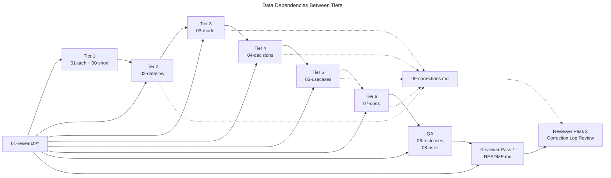
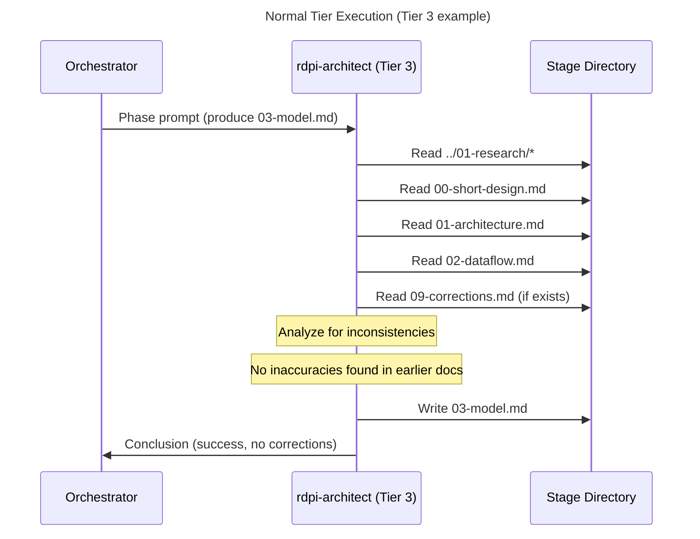
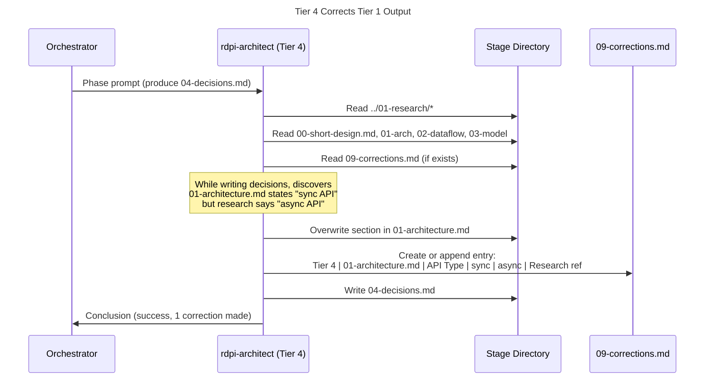
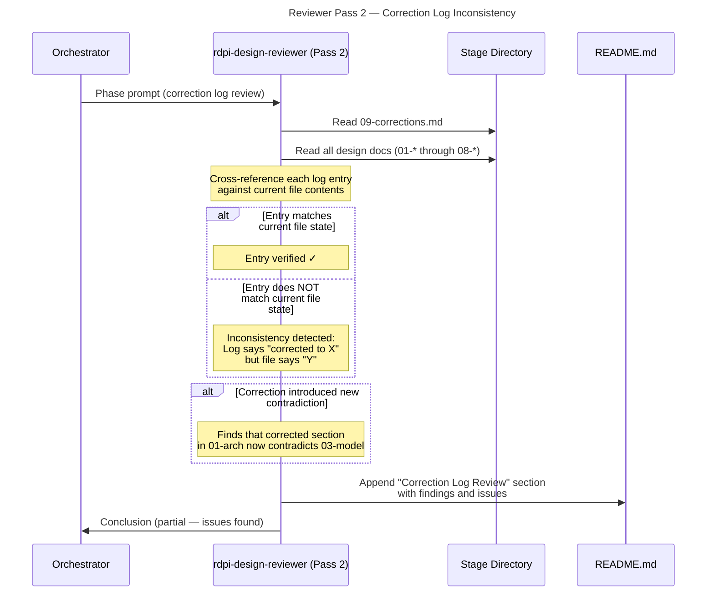

# Data Flow: Design Stage Per-Document Tiers

## Overview

The redesigned design stage has a sequential data flow where each tier reads all preceding outputs, writes its own document, and may overwrite earlier documents. The correction log (`09-corrections.md`) accumulates entries across tiers 2–6. The design reviewer reads everything including the correction log. [ref: ../01-research/01-codebase-analysis.md#5. Data Flow Between Phases]

## Per-Tier Data Flow Map

### Reads, Writes, and Corrections

| Tier | Phase | Reads | Writes (primary) | May Correct | Appends to |
|------|-------|-------|-------------------|-------------|------------|
| 1 | 1 | `../01-research/*` | `01-architecture.md`, `00-short-design.md` | — | — |
| 2 | 2 | `../01-research/*`, `00-short-design.md`, `01-architecture.md` | `02-dataflow.md` | `01-architecture.md`, `00-short-design.md` | `09-corrections.md` |
| 3 | 3 | `../01-research/*`, `00-short-design.md`, `01-architecture.md`, `02-dataflow.md` | `03-model.md` | `01-architecture.md`, `00-short-design.md`, `02-dataflow.md` | `09-corrections.md` |
| 4 | 4 | `../01-research/*`, `00-short-design.md`, `01-*` through `03-*` | `04-decisions.md` | `01-*`, `00-*`, `02-*`, `03-*` | `09-corrections.md` |
| 5 | 5 | `../01-research/*`, `00-short-design.md`, `01-*` through `04-*` | `05-usecases.md` | `01-*`, `00-*`, `02-*`, `03-*`, `04-*` | `09-corrections.md` |
| 6 | 6 | `../01-research/*`, `00-short-design.md`, `01-*` through `05-*` | `07-docs.md` | `01-*`, `00-*`, `02-*` through `05-*` | `09-corrections.md` |
| QA | 7 | `../01-research/*`, all design docs (`00-*` through `07-*`) | `06-testcases.md`, `08-risks.md` | — | — |
| Rev 1 | 8 | `../01-research/README.md`, all docs (`00-*` through `09-*`) | `README.md` | — | — |
| Rev 2 | 9 | `09-corrections.md`, all design docs, `README.md` (from phase 8) | Updates `README.md` | — | — |

**Key constraint**: QA designer and design reviewer do NOT have correction authority. Only designer tiers (phases 1–6) may overwrite earlier documents. [ref: ../01-research/01-codebase-analysis.md#3. QA Designer Agent, #4. Design Reviewer Agent]

### Data Dependency Graph



## Correction Log Accumulation

The correction log is a single cumulative file (`09-corrections.md`) that grows as tiers execute. [ref: ../01-research/03-open-questions.md#Q3]

### Accumulation Timeline

```
After Tier 1:  09-corrections.md does not exist
After Tier 2:  09-corrections.md may exist (0+ entries from Tier 2)
After Tier 3:  09-corrections.md may exist (0+ entries from Tiers 2–3)
After Tier 4:  09-corrections.md may exist (0+ entries from Tiers 2–4)
After Tier 5:  09-corrections.md may exist (0+ entries from Tiers 2–5)
After Tier 6:  09-corrections.md may exist (0+ entries from Tiers 2–6)
After QA:      09-corrections.md unchanged (QA has no correction authority)
After Rev 1:   09-corrections.md unchanged (reviewer is read-only)
After Rev 2:   09-corrections.md unchanged (reviewer is read-only; issues logged in README.md)
```

**File creation rule**: `09-corrections.md` is created by the first tier that makes a correction. If no tier makes corrections, the file never exists. The reviewer's Pass 2 handles both cases (see `01-architecture.md` § Design Reviewer Integration).

### Correction Entry Lifecycle

Each correction entry is a single table row with immutable fields once written:

```
| Tier | File Modified | Section | Original | Corrected | Rationale |
```

- **Tier**: The tier number that made the correction (2–6)
- **File Modified**: The filename that was overwritten (e.g., `01-architecture.md`)
- **Section**: The specific section heading within the file
- **Original**: Brief summary of what the text said before
- **Corrected**: Brief summary of what it says now
- **Rationale**: Why the change was necessary, referencing research or earlier design docs

Entries are append-only. A later tier MUST NOT modify or delete an earlier tier's correction log entries. If a later tier disagrees with an earlier correction, it makes its own correction to the file and appends a new entry referencing the earlier one.

## Sequence Diagrams

### (a) Normal Tier Execution — No Corrections Needed



### (b) Tier Finding and Correcting an Earlier Document



### (c) Design Reviewer Discovering Correction Log Inconsistency



## Design Reviewer Data Flow

### Pass 1 — General Review

**Input**: All files in stage directory + `../01-research/README.md`

```
Reads:
  ../01-research/README.md
  00-short-design.md
  01-architecture.md
  02-dataflow.md
  03-model.md
  04-decisions.md
  05-usecases.md
  06-testcases.md
  07-docs.md
  08-risks.md
  09-corrections.md (if exists)
  
Writes:
  README.md (full document: overview, goals, documents, key decisions, quality review)
```

Evaluates the standard 10-item checklist plus 3 new items for `00-short-design.md` and correction quality. [ref: ./01-architecture.md#Design Reviewer Integration]

### Pass 2 — Correction Log Review

**Input**: `09-corrections.md` (primary), all design docs (cross-reference), `README.md` (from pass 1)

```
Reads:
  09-corrections.md (if exists)
  01-architecture.md through 08-risks.md (for cross-reference)
  README.md (from pass 1)

Updates:
  README.md (appends "Correction Log Review" subsection)
```

**Two scenarios**:

1. **`09-corrections.md` exists**: Cross-reference each entry against current file state. Verify no correction introduced new contradictions. Report findings in README.md.
2. **`09-corrections.md` does not exist**: Spot-check for obvious cross-document inconsistencies that should have been caught. Confirm absence of corrections is legitimate. Record finding in README.md.

## Cross-Stage Data Flow for astp-version

```
manifest.json (version: "1.0.4")
    │
    ▼ [CLI install-time injection]
    │
installed template files (astp-version: "1.0.4" in YAML frontmatter)
    │
    ▼ [stage creator reads own frontmatter]
    │
stage README.md (astp-version: "1.0.4" in YAML frontmatter)
```

This flow is identical across all four stages. The stage creator reads `astp-version` from any installed template file's frontmatter and copies it into the stage README.md. [ref: ../01-research/02-supporting-infrastructure.md#3. Manifest — Bundle Version, ../01-research/03-open-questions.md#Q8]
