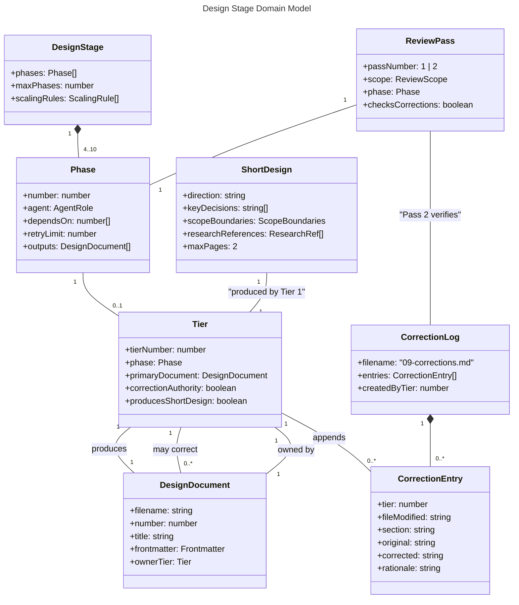
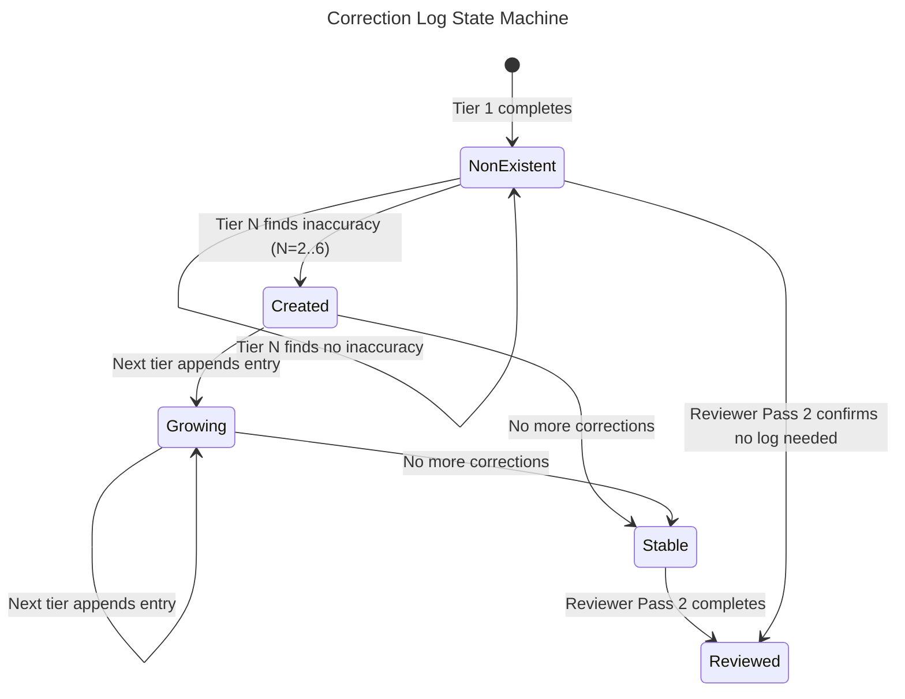

# Domain Model: Design Stage Per-Document Tiers

## Overview

The domain model captures the conceptual entities within the redesigned design stage skill file. These are not runtime types — they model the structure of the skill definition, phase prompts, and document relationships. [ref: ../01-research/01-codebase-analysis.md#1. Design Stage Skill]

## Entity Relationship Diagram



## TypeScript Type Definitions

These are design artifacts modeling the skill structure, not runtime code.

```typescript
/** Agent roles available in the design stage */
type AgentRole = 'rdpi-architect' | 'rdpi-qa-designer' | 'rdpi-design-reviewer';

/** Review scope for design reviewer passes */
type ReviewScope = 'general' | 'correction-log';

/** A design document produced by a tier */
interface DesignDocument {
  /** File number prefix (00-09) */
  number: number;
  /** Filename, e.g. "01-architecture.md" */
  filename: string;
  /** Human-readable title */
  title: string;
  /** Tier that owns (originally produces) this document */
  ownerTier: number;
  /** Frontmatter fields */
  frontmatter: DocumentFrontmatter;
}

/** Frontmatter for design phase outputs */
interface DocumentFrontmatter {
  title: string;
  date: string;        // YYYY-MM-DD
  stage: '02-design';
  role: AgentRole;
}

/** Frontmatter for stage README.md */
interface ReadmeFrontmatter {
  title: string;
  date: string;
  status: 'Inprogress' | 'Draft' | 'Review' | 'Approved' | 'Redraft';
  feature: string;
  research: string;    // relative path to research README
  'astp-version': string; // e.g. "1.0.4"
}

/** A designer tier — one per design document */
interface Tier {
  /** Tier number (1-6) */
  tierNumber: number;
  /** The phase this tier maps to */
  phaseNumber: number;
  /** The primary document this tier produces */
  primaryDocument: DesignDocument;
  /** Whether this tier can correct earlier documents */
  correctionAuthority: boolean; // false for tier 1, true for tiers 2-6
  /** Whether this tier also produces 00-short-design.md */
  producesShortDesign: boolean; // true only for tier 1
}

/** The 00-short-design.md structure */
interface ShortDesign {
  /** High-level design direction (2-3 paragraphs) */
  direction: string;
  /** Preliminary key decisions (up to 7, one sentence each) */
  keyDecisions: string[];
  /** Scope boundaries */
  scopeBoundaries: {
    inScope: string[];
    outOfScope: string[];
  };
  /** Research references (3-5 max) */
  researchReferences: Array<{
    path: string;
    relevance: string;
  }>;
}

/** A single row in the correction log table */
interface CorrectionEntry {
  /** Tier that made the correction (2-6) */
  tier: number;
  /** Filename that was modified */
  fileModified: string;
  /** Section heading within the file */
  section: string;
  /** Brief summary of original content */
  original: string;
  /** Brief summary of corrected content */
  corrected: string;
  /** Why the change was necessary */
  rationale: string;
}

/** The cumulative correction log */
interface CorrectionLog {
  filename: '09-corrections.md';
  /** Ordered list of entries (append-only) */
  entries: CorrectionEntry[];
  /** Tier that created the file (first tier to make a correction) */
  createdByTier: number | null; // null if no corrections exist
}

/** A design reviewer pass */
interface ReviewPass {
  /** Pass number: 1 = general review, 2 = correction log review */
  passNumber: 1 | 2;
  /** What this pass focuses on */
  scope: ReviewScope;
  /** Phase number for this pass */
  phaseNumber: number;
  /** Whether this pass examines the correction log */
  checksCorrections: boolean; // false for pass 1, true for pass 2
}

/** A phase in the design stage */
interface Phase {
  number: number;
  agent: AgentRole;
  dependsOn: number[];
  retryLimit: number;
  outputs: string[]; // filenames
  /** If this phase is a designer tier */
  tier?: Tier;
  /** If this phase is a reviewer pass */
  reviewPass?: ReviewPass;
}

/** Complete design stage definition */
interface DesignStage {
  phases: Phase[];
  /** Maximum phases allowed (replaces hard cap of 6) */
  maxPhases: number; // 10
  scalingRules: ScalingRule[];
}

/** Scaling rule for phase reduction */
interface ScalingRule {
  condition: string;
  effect: string;
  minimumPhases: number;
}
```

## Entity Relationships

### Tier → Document Ownership

Each tier owns exactly one primary document. Tier 1 additionally produces `00-short-design.md`. [ref: ../01-research/03-open-questions.md#Q6]

| Tier | Owns | Also Produces |
|------|------|---------------|
| 1 | `01-architecture.md` | `00-short-design.md` |
| 2 | `02-dataflow.md` | — |
| 3 | `03-model.md` | — |
| 4 | `04-decisions.md` | — |
| 5 | `05-usecases.md` | — |
| 6 | `07-docs.md` | — |

QA owns `06-testcases.md` and `08-risks.md`. `09-corrections.md` has no single owner — it is a shared append-only resource. `README.md` is owned by the design reviewer.

### Correction Authority Matrix

| Entity | Can Read All Docs | Can Write Own Doc | Can Overwrite Earlier Docs | Can Append to Log |
|--------|------------------|-------------------|---------------------------|-------------------|
| Tier 1 | ✗ (only research) | ✓ | ✗ (nothing precedes) | ✗ |
| Tier 2–6 | ✓ | ✓ | ✓ | ✓ |
| QA Designer | ✓ | ✓ | ✗ | ✗ |
| Reviewer Pass 1 | ✓ | README.md only | ✗ | ✗ |
| Reviewer Pass 2 | ✓ | README.md only | ✗ | ✗ |

[ref: ../01-research/01-codebase-analysis.md#8. Cross-Phase Consistency Mechanisms]

### Invariants

1. **Append-only log**: Correction log entries are never modified or removed after creation.
2. **Owner produces first**: A document must be created by its owner tier before any other tier can correct it.
3. **Self-correction forbidden**: A tier cannot log a "correction" to its own output — that is just normal writing.
4. **Factual corrections only**: Corrections must fix factual inaccuracies (contradictions with research, incorrect cross-references, stale assumptions). Stylistic or structural rewrites are not corrections.
5. **No QA/reviewer corrections**: Only designer tiers (phases 1–6) have correction authority. QA and reviewer phases are read-only with respect to existing design documents.
6. **Short design immutability after tier 1**: `00-short-design.md` can be corrected by later tiers (like any other document), but corrections should be minimal — it is a direction-setting document, not a specification.

## State Machine — Correction Log Lifecycle


