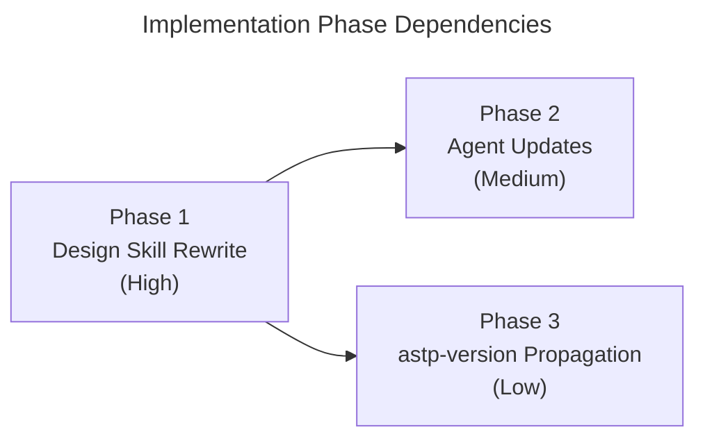

## Overview

Implement the redesigned 02-design stage by rewriting the design skill file (per-document tiers, correction mechanism, 00-short-design.md, scaling rules, phase cap 10), updating the architect and reviewer agents for new capabilities, and propagating `astp-version` across all four stage skills plus the research-reviewer agent. All changes are to markdown template files under `templates/rdpi/` — no runtime code modifications.

## Phase Map

## Phase Summary

| Phase | Name | Type | Dependencies | Complexity | Files |
|-------|------|------|--------------|------------|-------|
| 1 | Design Skill Rewrite | Sequential | None | High | `templates/rdpi/skills/rdpi-02-design/SKILL.md` |
| 2 | Agent Updates | Parallel with Phase 3 | Phase 1 | Medium | `templates/rdpi/agents/rdpi-architect.agent.md`, `templates/rdpi/agents/rdpi-design-reviewer.agent.md` |
| 3 | astp-version Propagation | Parallel with Phase 2 | Phase 1 | Low | `templates/rdpi/skills/rdpi-01-research/SKILL.md`, `templates/rdpi/skills/rdpi-03-plan/SKILL.md`, `templates/rdpi/skills/rdpi-04-implement/SKILL.md`, `templates/rdpi/agents/rdpi-research-reviewer.agent.md` |

## Execution Rules

- Phase 1 must complete and be verified before Phases 2 and 3 begin.
- Phases 2 and 3 have no mutual dependencies and may execute in parallel.
- All phases modify only markdown template files under `templates/rdpi/` — no runtime code, no `npm run ts-check`.
- Verification is content-based: structural diff, internal consistency, cross-file reference checks.

## Next Steps

Proceeds to implementation after human review.

## Quality Review

### Checklist

| # | Criterion | Status | Notes |
|---|-----------|--------|-------|
| 1 | Every design component mapped to task(s) | PASS | All 7 ADRs, tier structure, correction mechanism, 00-short-design.md, scaling rules, reviewer two-pass, and astp-version propagation are covered by specific tasks across Phases 1–3. All entities from 03-model.md, flows from 02-dataflow.md, and dataflow maps are reflected in Phase 1 tasks. |
| 2 | File paths concrete and verified | PASS | All 7 file paths from 07-docs.md verified against repository. Line number references in Phase 3 tasks (lines 68/70, 76/78, 90/92, 65) confirmed exact matches via grep. |
| 3 | Phase dependencies correct | PASS | Phase 1 → Phase 2, Phase 1 → Phase 3. No circular dependencies. Phases 2 and 3 are independent of each other. No phase reads an output not yet produced. |
| 4 | Verification criteria per phase | PASS | Phase 1: 11 items. Phase 2: 9 items. Phase 3: 6 items. All checklist-style with concrete assertions. |
| 5 | Each phase leaves project compilable | PASS | N/A for runtime — all changes are markdown templates. README Execution Rules explicitly state "no runtime code, no `npm run ts-check`" and define content-based verification instead. Appropriate for template-only changes. |
| 6 | No vague tasks — exact files and changes | PASS | All 14 tasks specify exact file paths, exact sections to modify, and detailed change descriptions (e.g., Task 1.1 specifies new invocation limits per agent role; Task 3.1 specifies current text and replacement text). |
| 7 | Design traceability (`[ref: ...]`) on all tasks | PASS | All 14 tasks across 3 phases have `[ref:]` links to design documents. References span 01-architecture.md, 02-dataflow.md, 04-decisions.md, and 07-docs.md as appropriate. |
| 8 | Parallel/sequential correctly marked | PASS | Phase 1 sequential (blocks 2 and 3). Phases 2 and 3 parallel. Within Phase 2: two agent files independent. Within Phase 3: four files independent. Matches the Mermaid dependency graph. |
| 9 | Complexity estimates present (L/M/H) | FAIL | Complexity estimates exist at the **phase** level (Phase 1: High, Phase 2: Medium, Phase 3: Low) but NOT at the per-**task** level. Individual tasks (1.1–1.7, 2.1–2.3, 3.1–3.4) lack complexity labels. |
| 10 | Documentation tasks proportional to existing docs/demos | PASS | `docs/` is empty. No documentation or demo tasks in the plan. Appropriate. |
| 11 | Mermaid dependency graph present | PASS | Flowchart LR with P1 → P2, P1 → P3. Includes complexity labels and phase names. |
| 12 | Phase summary table complete | PASS | Table has Phase, Name, Type, Dependencies, Complexity, and Files columns for all 3 phases. All 7 affected files listed. |

### Additional Criteria (from phase prompt)

| # | Criterion | Status | Notes |
|---|-----------|--------|-------|
| 13 | All 7 files from 07-docs.md accounted for | PASS | Skills: rdpi-02-design (Phase 1), rdpi-01-research/rdpi-03-plan/rdpi-04-implement (Phase 3). Agents: rdpi-architect/rdpi-design-reviewer (Phase 2), rdpi-research-reviewer (Phase 3). All 7 present. |
| 14 | Risk R1 (phase cap) mitigated | PASS | Task 1.7 explicitly rewrites scaling rules with cap of 10. Verification checks "cap of 10, define full/medium/simple/minimum phase counts". |
| 15 | Risk R2 (cascading corrections) mitigated | PASS | Task 1.3 encodes factual-only constraint and append-only log. Task 2.2 adds correction discipline rules to architect. Task 2.3 adds reviewer Pass 2 cross-reference verification. Three-layer mitigation. |
| 16 | Risk R4 (stage creator interpretation) mitigated | PASS | Task 1.2 defines unambiguous 9-phase table. Task 1.7 uses explicit scaling rules. Verification checks "All preserved content from original file... is intact" and "No references to old 4-phase structure remain", ensuring the existing skill format the stage creator depends on is preserved. |

### Documentation Proportionality

`docs/` is empty. No `apps/demos/` exists. The plan contains zero documentation or example tasks. This is proportional — the feature modifies only markdown template files under `templates/rdpi/`.

### Issues Found

1. **Per-task complexity estimates missing**
   - **Where**: All three phase files (`01-design-skill-rewrite.md` Tasks 1.1–1.7, `02-agent-updates.md` Tasks 2.1–2.3, `03-astp-version-propagation.md` Tasks 3.1–3.4)
   - **What's wrong**: Tasks have no individual complexity labels (Low/Medium/High). Only phase-level estimates exist.
   - **Expected**: Each task should have a complexity estimate (e.g., Task 1.2 "Rewrite Typical Phase Structure table" = High, Task 3.1 "Add astp-version to rdpi-01-research" = Low)
   - **Severity**: Low — phase-level estimates are present and sufficient for execution ordering; per-task estimates would improve granularity but are not blocking.
