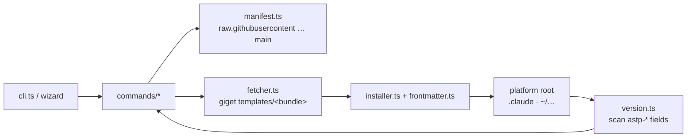

# CLAUDE.md

This file provides guidance to Claude Code (claude.ai/code) when working with code in this repository.

`astp` (`@fozy-labs/astp`) is a Node ≥ 22 CLI that installs, updates, checks and deletes bundles of agent Markdown files (skills, agents, instructions) for Claude Code. The repo holds both the CLI (`src/`) and the bundles it ships (`templates/`).

## Commands

- `npm run check:all` - everything CI checks, plus the marketplace staleness check
- `npm test` - type-checks tests (`tsconfig.test.json`), then `vitest run`
- `npx vitest run src/core/__tests__/manifest.test.ts` - one file; add `-t "<name>"` for one test
- `npm run ts-check` / `npm run lint` / `npm run format:check` - checks one by one
- `npm run build` - `tsc` + `tsc-alias` into `dist/` (rewrites the `@/` alias)
- `npm run generate:skills` - rewrite `.claude-plugin/marketplace.json` after any `templates/manifest.json` change

## Map

- `src/` - CLI source; `@/*` aliases `src/*`
  - `cli.ts` - commander entry, parses `--platform` / `--target`; no subcommand → wizard
  - `commands/` - one `execute*` per command: install, update, check, delete
  - `core/` - no UI; everything goes through `core/index.ts`
    - `manifest.ts` - fetch `templates/manifest.json` from GitHub `main`, validate it
    - `fetcher.ts` - giget download of one bundle dir into a temp dir
    - `installer.ts` - write a file under the install root, path-traversal guard
    - `frontmatter.ts` - inject / read / strip `astp-*` fields, content hash
    - `version.ts` - scan installed files, compare with manifest, detect local edits, remove
  - `types/` - `Manifest`, `Bundle`, `Platform`
    - `platform.ts` - bundle ↔ platform filter
    - `resolve-target.ts` - platform × project/user → root dir (`.claude`, `$CLAUDE_CONFIG_DIR` or `~/.claude`)
  - `ui/` - `@clack/prompts` wizard and prompts
- `templates/` - shipped bundles; author guide in [templates/README.md](templates/README.md)
  - `manifest.json` - source of truth: bundles, versions, platforms, `source` → `target` items
  - `<bundle>/` - fozy-labs, docs, design, matt
- `scripts/` - marketplace generator (run by Node type stripping, own `tsconfig.json`)
- `tests/`
  - `e2e/` - command flows with `fetchManifest` / `downloadBundle` mocked, no network
  - `scripts/` - marketplace generator tests
- `.claude-plugin/marketplace.json` - generated for `npx skills`; never edit by hand
- `.claude/skills/markdown-craft/` - this repo's own astp-installed copy; edit `templates/docs/...` instead
- `.github/workflows/` - `ci.yml` checks; `publish.yml` publishes to npm after CI passes on a `v*` tag

## Architecture

- The CLI always reads templates from GitHub `main`, never from the local checkout: a `templates/` change reaches users on merge, not on npm release, and cannot be tried locally through `astp install`.
- No lock file: `astp-source`, `astp-bundle`, `astp-version` and `astp-hash` in the header of each installed skill file are the whole install state. `update` skips files whose hash no longer matches unless `--force`.
- Template sources never contain `astp-*` fields; the installer adds them.
- A manifest item's `target` is its `source` minus the bundle prefix, and giget lays files out by `target`.
- Watch that changes landing in `main` come with a version bump for their bundle in `manifest.json`.
- A new platform needs an entry in `ALL_PLATFORMS` and in `PLATFORM_ROOTS` (`resolve-target.ts`).

Commits follow Conventional Commits with scopes such as `templates`, `fozy-labs`, `markdown-craft`, `claude-code`; releases are `chore(release): vX.Y.Z` plus a `v*` tag.
